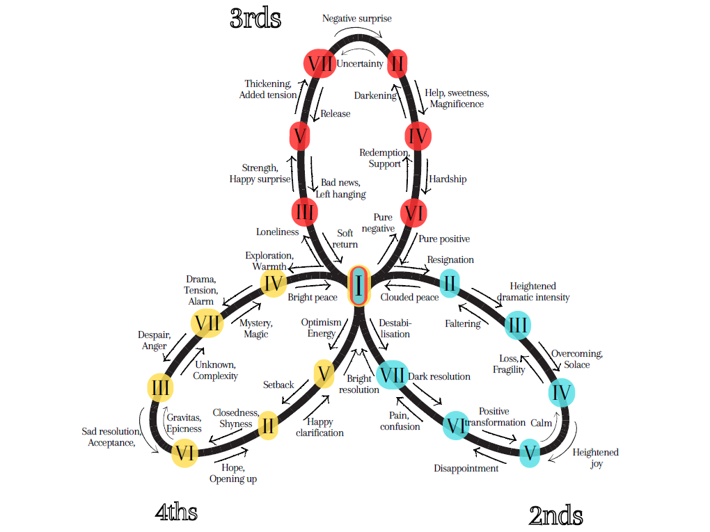

# Ziya - The Music Theory Assistant (hackathon_chord_prog)

This is **Ziya**, a console program that allows the creation of harmonic chord progressions, guiding user choices based on how chord changes feel, suggesting not only harmonic coherence, but also evidence of the emotional roadmap hidden behind the sound.

Created for [Boot.dev](http://boot.dev) 2025 Hackathon.

### Chord Progression Builder
This tool lets you pick a key and then add as many chords as you want, and after you're done, it outputs your chord progression and the emotional feels associated with it. 

## Tonal Map of Chord Sequences
The emotional significance of each chord interaction was defined thanks to the work of Pur Pasteur, shown in the following diagram: 

This diagram was obtained from Pasteur's youtube video: ["Which Chord Sequences Produce Which Emotions (A Complete Map Of The Tonal System)](https://www.youtube.com/watch?v=n6MViTAfNio)

## Main Library: mingus
Everything is built with the package **[mingus](https://github.com/bspaans/python-mingus)**, which proved to be incredibly intuitive to implement, and seems to be scalable beyond my imagination. Documentation is also great, very clear and precise. Check it out at **[mingus_webpage](https://bspaans.github.io/python-mingus/index.html)**.  

## Self reflection
As a self-taught musician who hasn't yet explored as much as I've liked into the Music Theory field, building this tool has given me insights about how chords interact, what their roles are in scales and progressions, and of course, how to play my instruments better. 

If you are someone that doesn't know how to start in Music Theory, or you are at least curious about it, I believe Ziya can help you figure out some new things in a simple way. 

## Future Improvements
I would like to add the following improvements to Ziya:

- The suggestions made by Ziya are currently limited to the Diatonic Harmony based on a specific Key. I'd like to expand this to incorporate the Chromatic scale, and every semitonal interaction, with their respective emotional/mood effect.
- Include the possibility of adding tags when saving progressions. Instead of just adding [key, progression], have [key, progression, tags]. Could be useful to have a reminder of the overall mood of that specific progression. 
- Change the data structure of the chords into some tree/nested dictionary, might be more efficient and easier to navigate.
- Melody Builder, instead of choosing chords, use individual notes with defined lengths to create a melodic sequence.
- Instrumental generator. Considering mingus can define notes, chords, intervals, etc. and can also pass all of this into MIDI, it could be cool to listen to everything that's created. This may also integrate both the progressions and the melodies from the Melody Builder.
